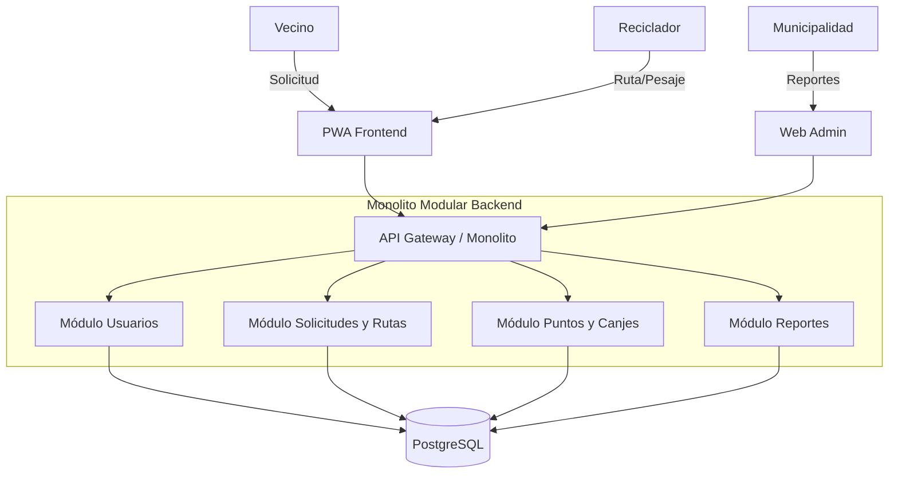

# EcoRecicla AQP – Laboratorio 04: Fundamentos de arquitectura de software
Construcción de Software · EPIS-UNSA · 2026-B · Grupo XX

## Integrantes
| Nombre | Rol en el laboratorio |
|---|---|
| Pari Charrez Dean Diego | Arquitecto de software, redactor de ADRs, diagramador y verificador de IA |

## Caso
EcoRecicla AQP es una plataforma digital para la ciudad de Arequipa que optimiza la cadena de reciclaje conectando a vecinos, recicladores formalizados y la administración municipal. Permite solicitar recojos programados, registrar el pesaje, acumular puntos ecológicos y generar reportes consolidados por distrito. El atributo de calidad crítico es la **Modificabilidad (QA-01)**, requiriendo que la adición de un nuevo distrito o la modificación de reglas de canje no afecte a otros componentes y se realice en $\le 2$ días-persona.

## Arquitectura elegida

## Decisiones arquitectónicas
- [ADR-001: Selección del estilo arquitectónico Monolito Modular](docs/architecture/adr/001-estilo-arquitectonico.md)
- [ADR-002: Estrategia de privacidad de datos y cumplimiento de la Ley N° 29733](docs/architecture/adr/002-estrategia-privacidad-datos.md)
- [ADR-003: Selección del motor de base de datos relacional (PostgreSQL)](docs/architecture/adr/003-seleccion-motor-bd.md)

## Reflexión sobre el uso de la IA
La inteligencia artificial actuo como un copiloto eficaz para acelerar la estructuración de la documentación técnica y generar la sintaxis inicial de los diagramas (Mermaid, PlantUML y Python Diagrams). Sin embargo, presento limitaciones al cortar bloques de codigo extensos, omitir directivas de posicionamiento visual y sugerir sintaxis obsoleta que impedía el correcto renderizado. Aprendi que la IA no reemplaza el criterio del arquitecto: fue indispensable validar paso a paso la consistencia de cada entregable, verificar de forma independiente la sintaxis en renderizadores oficiales e iterar los prompts para adaptar las respuestas estrictamente a las restricciones del caso de estudio.
